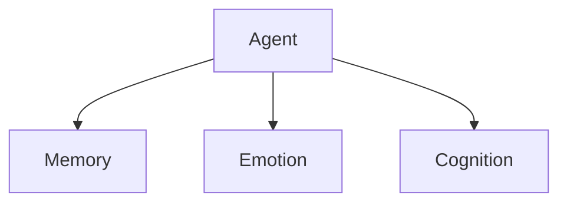

# SYMindX Documentation Site

This directory contains the comprehensive documentation for SYMindX, built with Docusaurus. The documentation provides everything developers need to understand, implement, and extend the SYMindX AI agent framework.

## 📚 Documentation Structure

### Getting Started
- **Installation** - Step-by-step setup guide
- **Quick Start** - Build your first agent in 10 minutes
- **Your First Agent** - Detailed agent customization guide
- **Configuration** - Environment and runtime configuration

### Architecture
- **Overview** - System architecture and design principles
- **Core Runtime** - Runtime engine and lifecycle management
- **Module System** - Memory, emotion, and cognition modules
- **Extension System** - Plugin architecture and development
- **Portal System** - AI provider integrations
- **Event System** - Event-driven communication
- **Memory System** - Persistent agent memory
- **Security** - Security architecture and best practices

### Modules
- **Memory Providers** - SQLite, Supabase, Neon, custom providers
- **Emotion System** - RuneScape-style emotion stack
- **Cognition System** - HTN planner, reactive, hybrid systems

### Extensions
- **Slack** - Chat platform integration
- **RuneLite** - Game automation
- **Twitter** - Social media posting
- **Telegram** - Messaging platform
- **API** - HTTP/WebSocket endpoints
- **MCP** - Model Context Protocol
- **Custom Extensions** - Building your own

### AI Portals
- **OpenAI** - GPT models integration
- **Anthropic** - Claude models integration  
- **Groq** - Fast inference
- **xAI** - Grok models
- **OpenRouter** - Multi-provider routing
- **Custom Portals** - Building custom AI integrations

### Developer Guides
- **Agent Development** - Creating custom AI characters
- **Plugin Development** - Building extensions and skills
- **Character Creation** - Designing agent personalities
- **Testing** - Testing strategies and tools
- **Debugging** - Troubleshooting and diagnostics
- **Best Practices** - Recommended patterns and practices

### Examples
- **Basic Agent** - Simple conversational agent
- **Gaming Bot** - RuneScape automation example
- **Social Media Agent** - Twitter automation
- **Enterprise Assistant** - Business workflow automation
- **Multi-Agent Coordination** - Agent team management

### API Reference
- **REST API** - HTTP endpoints for agent management
- **WebSocket API** - Real-time communication
- **TypeScript SDK** - Programmatic access
- **Plugin API** - Extension development interfaces
- **OpenAPI Specification** - Complete API reference

### Deployment
- **Local Development** - Development environment setup
- **Production** - Production deployment guide
- **Docker** - Containerized deployments
- **Cloud Platforms** - AWS, GCP, Azure deployment
- **Monitoring** - Performance and health monitoring

### Operations
- **Configuration** - Runtime configuration options
- **Logging** - Logging and debugging
- **Monitoring** - System monitoring and metrics
- **Troubleshooting** - Common issues and solutions
- **Performance** - Optimization and scaling
- **Security** - Security hardening

### Web Interface
- **Overview** - Web dashboard features
- **Agent Controls** - Managing agents through UI
- **Thought Streams** - Real-time agent thoughts
- **Emotion Visualization** - Emotion state tracking
- **Streaming Integration** - OBS and streaming setup

## 🚀 Development

### Prerequisites
- Node.js 18+
- npm or yarn

### Installation
```bash
cd docs-site
npm install
```

### Development Server
```bash
npm start
```

This starts a local development server on `http://localhost:3001` with hot reloading.

### Building
```bash
npm run build
```

Generates static content into the `build` directory for production deployment.

### Deployment
```bash
npm run serve
```

Serves the production build locally for testing.

## 🎨 Customization

### Theme
The documentation uses a custom theme with SYMindX branding:
- **Colors** - SYMindX brand colors and gradients
- **Typography** - Inter font family with custom headings
- **Components** - Custom React components for features
- **Styling** - Enhanced CSS with animations and effects

### Content
- **Markdown** - All documentation written in MDX (Markdown + JSX)
- **Components** - Custom React components for interactive content
- **Diagrams** - Mermaid.js for system architecture diagrams
- **Code Examples** - Syntax highlighted code blocks

### Structure
```
docs-site/
├── docs/                    # Documentation content
│   ├── getting-started/     # Getting started guides
│   ├── architecture/        # Architecture documentation
│   ├── modules/            # Module documentation
│   ├── extensions/         # Extension guides
│   ├── portals/           # AI portal documentation
│   ├── guides/            # Developer guides
│   ├── examples/          # Example implementations
│   ├── api/               # API reference
│   ├── deployment/        # Deployment guides
│   ├── operations/        # Operations documentation
│   └── web-interface/     # Web interface guides
├── src/                   # Site source code
│   ├── components/        # React components
│   ├── css/              # Custom styles
│   └── pages/            # Custom pages
├── static/               # Static assets
│   ├── img/              # Images and icons
│   └── files/            # Downloadable files
├── docusaurus.config.ts  # Site configuration
├── sidebars.ts           # Sidebar navigation
└── package.json          # Dependencies
```

## 📖 Writing Documentation

### Guidelines
- **Clear Structure** - Use consistent heading hierarchy
- **Code Examples** - Include working code examples
- **Screenshots** - Add visual guides where helpful
- **Cross-references** - Link to related documentation
- **Maintenance** - Keep documentation up to date with code changes

### Markdown Features
```markdown
# Standard Markdown
**Bold text**, *italic text*, `inline code`

# Code Blocks with Syntax Highlighting
```typescript
const agent = new SYMindXAgent(config)
```

# Admonitions
:::tip
This is a helpful tip!
:::

:::warning
This is a warning about potential issues.
:::

:::danger
This is a critical warning!
:::

# Mermaid Diagrams


# Tabs
import Tabs from '@theme/Tabs';
import TabItem from '@theme/TabItem';

<Tabs>
  <TabItem value="js" label="JavaScript">
    ```js
    console.log('Hello World');
    ```
  </TabItem>
  <TabItem value="ts" label="TypeScript">
    ```ts
    console.log('Hello World');
    ```
  </TabItem>
</Tabs>
```

### Adding New Documentation
1. Create new `.md` or `.mdx` file in appropriate directory
2. Add to sidebar configuration in `sidebars.ts`
3. Follow existing content structure and style
4. Include code examples and practical use cases
5. Add cross-references to related documentation

## 🔧 Configuration

### Site Configuration
Edit `docusaurus.config.ts` to modify:
- Site metadata (title, description, URL)
- Navigation structure
- Theme configuration
- Plugin settings
- Search configuration

### Sidebar Configuration
Edit `sidebars.ts` to modify:
- Documentation hierarchy
- Category organization
- Page ordering
- Auto-generated sections

### Styling
Edit `src/css/custom.css` to customize:
- Brand colors and theme
- Typography and fonts
- Component styling
- Responsive design
- Dark mode support

## 🚢 Deployment

### Static Hosting
The documentation can be deployed to any static hosting provider:
- **GitHub Pages** - Automatic deployment from repository
- **Netlify** - Connect repository for automatic builds
- **Vercel** - Git integration with preview deployments
- **AWS S3** - Static website hosting
- **Azure Static Web Apps** - Integrated CI/CD

### Build Process
```bash
# Install dependencies
npm install

# Build for production
npm run build

# Test production build
npm run serve
```

### GitHub Actions
Example deployment workflow:
```yaml
name: Deploy Documentation

on:
  push:
    branches: [main]
    paths: ['docs-site/**']

jobs:
  deploy:
    runs-on: ubuntu-latest
    steps:
      - uses: actions/checkout@v3
      - uses: actions/setup-node@v3
        with:
          node-version: 18
          cache: npm
          cache-dependency-path: docs-site/package-lock.json
      
      - name: Install dependencies
        run: cd docs-site && npm ci
      
      - name: Build documentation
        run: cd docs-site && npm run build
      
      - name: Deploy to GitHub Pages
        uses: peaceiris/actions-gh-pages@v3
        with:
          github_token: ${{ secrets.GITHUB_TOKEN }}
          publish_dir: docs-site/build
```

## 📊 Analytics and Search

### Analytics
Add Google Analytics by updating `docusaurus.config.ts`:
```typescript
gtag: {
  trackingID: 'G-XXXXXXXXXX',
  anonymizeIP: true,
},
```

### Search
Configure Algolia DocSearch:
```typescript
algolia: {
  appId: 'YOUR_APP_ID',
  apiKey: 'YOUR_SEARCH_API_KEY',
  indexName: 'symindx',
  contextualSearch: true,
},
```

## 🤝 Contributing

### Content Contributions
1. Fork the repository
2. Create a feature branch for your documentation changes
3. Write clear, helpful documentation following existing patterns
4. Test locally with `npm start`
5. Submit a pull request with detailed description

### Issue Reporting
Report documentation issues on GitHub:
- Missing information
- Outdated content
- Broken links or examples
- Unclear explanations
- Suggestions for improvement

### Style Guide
- **Tone** - Friendly, professional, helpful
- **Structure** - Clear headings, logical flow
- **Examples** - Working code examples for all features
- **Links** - Cross-reference related documentation
- **Images** - Include screenshots for UI-related content

## 📚 Resources

### Docusaurus Documentation
- [Docusaurus Documentation](https://docusaurus.io/docs)
- [Markdown Features](https://docusaurus.io/docs/markdown-features)
- [Deployment Guide](https://docusaurus.io/docs/deployment)

### SYMindX Resources
- [SYMindX Repository](https://github.com/symindx/symindx)
- [Community Discord](https://discord.gg/symindx)
- [Developer Blog](https://blog.symindx.dev)

---

This documentation site is designed to provide the best possible developer experience for SYMindX. Clear, comprehensive documentation is essential for framework adoption and developer success. 📚✨