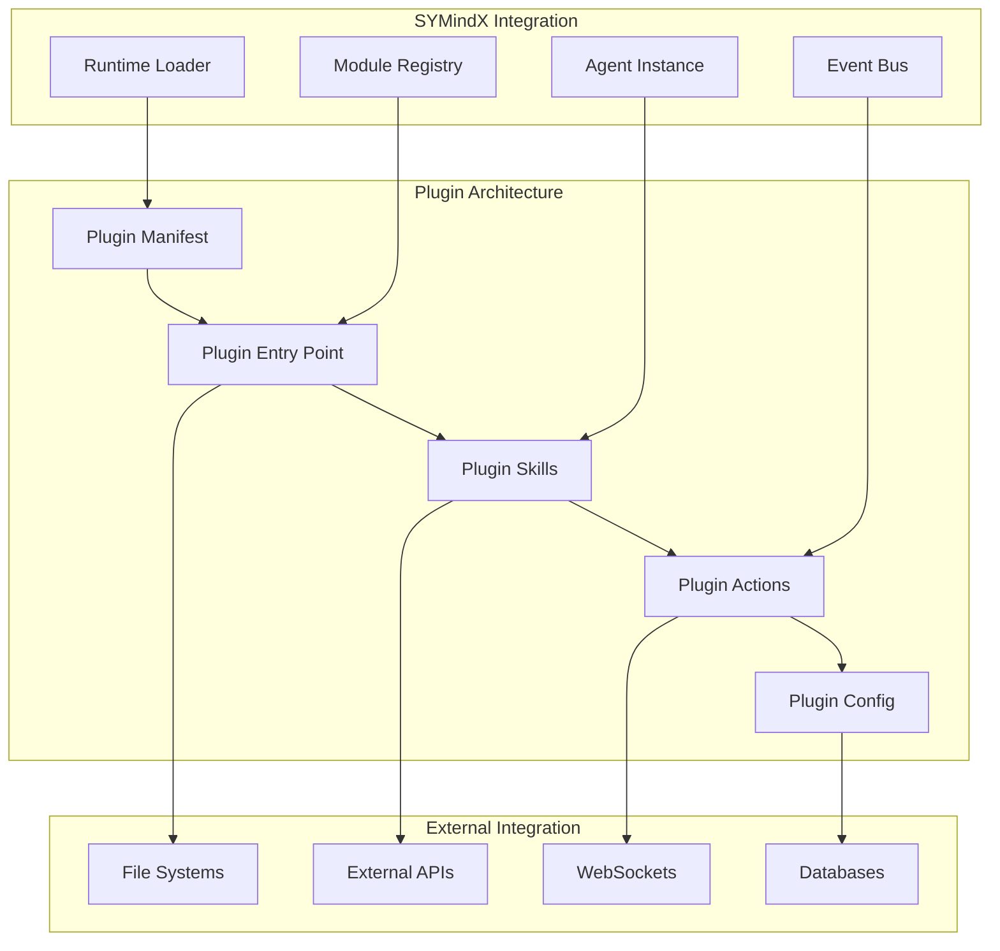

# Plugin Development Guide

Learn how to build powerful extensions for SYMindX that integrate with external platforms, add new capabilities, and extend agent functionality. This comprehensive guide covers everything from basic plugins to advanced enterprise integrations.

## Plugin Architecture Overview

SYMindX plugins are modular components that extend agent capabilities through a standardized interface. They can:

- **Connect to External Platforms**: Slack, Discord, Twitter, games, APIs
- **Add New Skills**: Custom actions and behaviors
- **Provide Data Sources**: Real-time information feeds
- **Implement Custom Logic**: Domain-specific functionality



## Plugin Types

### 1. Extension Plugins
Add platform integrations and external connectivity:
- **Communication Platforms**: Slack, Discord, Telegram
- **Social Media**: Twitter, Reddit, LinkedIn
- **Gaming**: RuneLite, game APIs
- **Developer Tools**: GitHub, Jira, CI/CD systems

### 2. Skill Plugins
Extend agent capabilities with new actions:
- **Data Processing**: File manipulation, data analysis
- **Content Creation**: Image generation, document creation
- **Automation**: Workflow management, task scheduling
- **Integration**: API connections, data synchronization

### 3. Provider Plugins
Add new backend services:
- **Memory Providers**: New database types, caching systems
- **AI Portals**: Custom AI services, specialized models
- **Storage Systems**: Cloud storage, content delivery networks
- **Authentication**: SSO providers, custom auth systems

## Creating Your First Plugin

### Step 1: Plugin Structure

Create a new directory for your plugin:

```bash
mkdir my-awesome-plugin
cd my-awesome-plugin
```

### Step 2: Plugin Manifest

Create `plugin.json`:

```json
{
  "id": "my-awesome-plugin",
  "name": "My Awesome Plugin",
  "version": "1.0.0",
  "description": "An awesome plugin that does amazing things",
  "type": "extension",
  "author": "Your Name",
  "license": "MIT",
  "homepage": "https://github.com/yourname/my-awesome-plugin",
  "keywords": ["awesome", "example", "tutorial"],
  "engines": {
    "symindx": ">=1.0.0",
    "node": ">=18.0.0"
  },
  "main": "index.js",
  "enabled": true,
  "dependencies": {
    "axios": "^1.6.0",
    "ws": "^8.14.0"
  },
  "permissions": [
    "network.http",
    "network.websocket",
    "storage.local"
  ],
  "configuration": {
    "apiKey": {
      "type": "string",
      "required": true,
      "description": "API key for external service"
    },
    "webhookUrl": {
      "type": "string",
      "required": false,
      "description": "Optional webhook URL for notifications"
    },
    "maxRetries": {
      "type": "number",
      "default": 3,
      "description": "Maximum number of retry attempts"
    }
  }
}
```

### Step 3: Plugin Implementation

Create `index.ts`:

```typescript
import { Extension, Agent, ExtensionAction, ExtensionConfig } from '@symindx/types'

// Example plugin implementation
interface MyAwesomePluginType extends Extension {
  id = 'my-awesome-plugin'
  name = 'My Awesome Plugin'
  version = '1.0.0'
  enabled = true
  
  private apiKey: string
  private webhookUrl?: string
  private maxRetries: number
  
  constructor(public config: ExtensionConfig) {
    this.apiKey = config.apiKey
    this.webhookUrl = config.webhookUrl
    this.maxRetries = config.maxRetries || 3
  }
  
  async init(agent: Agent): Promise<void> {
    console.log(`🚀 Initializing ${this.name} for agent ${agent.name}`)
    
    // Initialize external connections
    await this.setupExternalConnections()
    
    // Register event listeners
    this.setupEventListeners(agent)
    
    console.log(`✅ ${this.name} initialized successfully`)
  }
  
  async tick(agent: Agent): Promise<void> {
    // Called every runtime tick - implement ongoing operations
    await this.checkForUpdates(agent)
    await this.processQueue(agent)
  }
  
  // Plugin-specific actions
  actions = {
    sendAwesomeMessage: {
      description: 'Send an awesome message through the plugin',
      parameters: {
        message: { type: 'string', required: true },
        recipient: { type: 'string', required: true },
        priority: { type: 'string', enum: ['low', 'medium', 'high'], default: 'medium' }
      },
      execute: this.sendAwesomeMessage.bind(this)
    },
    
    getAwesomeData: {
      description: 'Retrieve awesome data from external service',
      parameters: {
        query: { type: 'string', required: true },
        limit: { type: 'number', default: 10 }
      },
      execute: this.getAwesomeData.bind(this)
    }
  }
  
  // Event handlers
  events = {
    'message.received': this.handleMessageReceived.bind(this),
    'agent.emotion.changed': this.handleEmotionChanged.bind(this),
    'system.startup': this.handleSystemStartup.bind(this)
  }
  
  private async setupExternalConnections(): Promise<void> {
    // Initialize external API connections, websockets, etc.
    try {
      // Example: Setup API client
      this.apiClient = new ApiClient(this.apiKey)
      await this.apiClient.connect()
      
      // Example: Setup websocket connection
      if (this.webhookUrl) {
        this.websocket = new WebSocket(this.webhookUrl)
        this.websocket.on('message', this.handleWebSocketMessage.bind(this))
      }
    } catch (error) {
      console.error(`❌ Failed to setup external connections:`, error)
      throw error
    }
  }
  
  private setupEventListeners(agent: Agent): void {
    // Register for agent-specific events
    agent.eventBus?.on('custom.event', this.handleCustomEvent.bind(this))
  }
  
  private async sendAwesomeMessage(agent: Agent, params: any): Promise<ActionResult> {
    try {
      const { message, recipient, priority } = params
      
      console.log(`📤 Sending awesome message to ${recipient}`)
      
      // Implement your message sending logic
      const response = await this.apiClient.sendMessage({
        to: recipient,
        content: message,
        priority: priority,
        from: agent.name
      })
      
      // Store in agent memory
      await agent.memory.store(agent.id, {
        type: 'action',
        content: `Sent message to ${recipient}: ${message}`,
        metadata: { plugin: this.id, action: 'sendAwesomeMessage' },
        timestamp: new Date()
      })
      
      return {
        success: true,
        type: 'success',
        result: {
          messageId: response.id,
          status: 'delivered',
          timestamp: response.timestamp
        }
      }
    } catch (error) {
      console.error(`❌ Failed to send awesome message:`, error)
      return {
        success: false,
        type: 'error',
        error: error.message
      }
    }
  }
  
  private async getAwesomeData(agent: Agent, params: any): Promise<ActionResult> {
    try {
      const { query, limit } = params
      
      console.log(`🔍 Retrieving awesome data for query: ${query}`)
      
      // Implement your data retrieval logic
      const data = await this.apiClient.search({
        query: query,
        limit: limit,
        context: agent.name
      })
      
      return {
        success: true,
        type: 'data',
        result: {
          query: query,
          results: data.results,
          total: data.total,
          timestamp: new Date()
        }
      }
    } catch (error) {
      console.error(`❌ Failed to retrieve awesome data:`, error)
      return {
        success: false,
        type: 'error',
        error: error.message
      }
    }
  }
  
  private async handleMessageReceived(event: AgentEvent): Promise<void> {
    // Handle incoming messages
    console.log(`📨 Received message event:`, event)
    
    // Process the message and potentially trigger actions
    if (event.data.mention && event.data.mention.includes('awesome')) {
      // Trigger awesome response
      await this.sendAwesomeMessage(event.agent, {
        message: "That's awesome! 🎉",
        recipient: event.data.sender,
        priority: 'high'
      })
    }
  }
  
  private async handleEmotionChanged(event: AgentEvent): Promise<void> {
    // React to agent emotion changes
    const { emotion, intensity } = event.data
    
    if (emotion === 'excited' && intensity > 0.8) {
      // Agent is very excited, maybe share the excitement!
      console.log(`🎉 Agent is very excited! Emotion: ${emotion}, Intensity: ${intensity}`)
    }
  }
  
  private async handleSystemStartup(event: AgentEvent): Promise<void> {
    // Handle system startup
    console.log(`🚀 System startup detected, performing initialization tasks`)
  }
  
  private async checkForUpdates(agent: Agent): Promise<void> {
    // Check for external updates periodically
    try {
      const updates = await this.apiClient.checkUpdates()
      
      if (updates.length > 0) {
        console.log(`📬 Found ${updates.length} updates`)
        
        // Process updates
        for (const update of updates) {
          await this.processUpdate(agent, update)
        }
      }
    } catch (error) {
      console.error(`❌ Failed to check for updates:`, error)
    }
  }
  
  private async processQueue(agent: Agent): Promise<void> {
    // Process any queued operations
    // This is called every tick, so keep it lightweight
  }
  
  private async processUpdate(agent: Agent, update: any): Promise<void> {
    // Process a single update
    await agent.memory.store(agent.id, {
      type: 'update',
      content: `Received update: ${update.title}`,
      metadata: { 
        plugin: this.id,
        updateId: update.id,
        source: update.source
      },
      timestamp: new Date()
    })
  }
  
  private handleWebSocketMessage(message: string): void {
    try {
      const data = JSON.parse(message)
      console.log(`📡 WebSocket message received:`, data)
      
      // Process websocket message
      // Emit event to agent runtime
      this.emitEvent({
        id: `ws_${Date.now()}`,
        type: 'external.websocket.message',
        source: this.id,
        data: data,
        timestamp: new Date(),
        processed: false
      })
    } catch (error) {
      console.error(`❌ Failed to parse WebSocket message:`, error)
    }
  }
  
  private handleCustomEvent(event: AgentEvent): void {
    console.log(`🎯 Custom event received:`, event)
  }
  
  private emitEvent(event: AgentEvent): void {
    // Emit event to the system event bus
    // This would be injected by the runtime
  }
  
  // Cleanup method (optional)
  async cleanup(): Promise<void> {
    console.log(`🧹 Cleaning up ${this.name}`)
    
    // Close external connections
    if (this.websocket) {
      this.websocket.close()
    }
    
    if (this.apiClient) {
      await this.apiClient.disconnect()
    }
    
    console.log(`✅ ${this.name} cleanup completed`)
  }
}

// Factory function for plugin creation
const createMyAwesomePlugin = (config: ExtensionConfig): MyAwesomePluginType => {
  return new MyAwesomePluginImpl(config)
}

// Export plugin metadata
export const pluginInfo = {
  id: 'my-awesome-plugin',
  name: 'My Awesome Plugin',
  version: '1.0.0',
  type: 'extension'
}
```

## Advanced Plugin Patterns

### Skill-Based Plugin

For plugins that primarily add new capabilities:

```typescript
import { Skill, SkillResult, SkillParameters } from '@symindx/types'

// Data analysis skill implementation
interface DataAnalysisSkillType extends Skill {
  id = 'data-analysis'
  name = 'Data Analysis'
  description = 'Analyze data and generate insights'
  
  parameters: SkillParameters = {
    dataset: { type: 'object', required: true },
    analysisType: { type: 'string', enum: ['trend', 'correlation', 'summary'] },
    outputFormat: { type: 'string', enum: ['text', 'chart', 'table'], default: 'text' }
  }
  
  async execute(agent: Agent, params: any): Promise<SkillResult> {
    const { dataset, analysisType, outputFormat } = params
    
    try {
      // Perform data analysis
      const analysis = await this.analyzeData(dataset, analysisType)
      
      // Format output
      const formattedResult = await this.formatOutput(analysis, outputFormat)
      
      // Store insights in memory
      await agent.memory.store(agent.id, {
        type: 'insight',
        content: `Data analysis completed: ${analysisType}`,
        metadata: { 
          skill: this.id,
          analysisType,
          outputFormat,
          dataPoints: dataset.length
        },
        timestamp: new Date()
      })
      
      return {
        success: true,
        type: 'analysis',
        result: formattedResult,
        confidence: analysis.confidence
      }
    } catch (error) {
      return {
        success: false,
        type: 'error',
        error: error.message
      }
    }
  }
  
  private async analyzeData(dataset: any[], type: string): Promise<any> {
    // Implement analysis logic
    switch (type) {
      case 'trend':
        return this.analyzeTrend(dataset)
      case 'correlation':
        return this.analyzeCorrelation(dataset)
      case 'summary':
        return this.generateSummary(dataset)
      default:
        throw new Error(`Unknown analysis type: ${type}`)
    }
  }
  
  private async formatOutput(analysis: any, format: string): Promise<any> {
    // Implement output formatting
    switch (format) {
      case 'text':
        return this.formatAsText(analysis)
      case 'chart':
        return this.formatAsChart(analysis)
      case 'table':
        return this.formatAsTable(analysis)
      default:
        return analysis
    }
  }
  
  // Analysis implementations...
  private analyzeTrend(dataset: any[]): any { /* ... */ }
  private analyzeCorrelation(dataset: any[]): any { /* ... */ }
  private generateSummary(dataset: any[]): any { /* ... */ }
  
  // Formatting implementations...
  private formatAsText(analysis: any): string { /* ... */ }
  private formatAsChart(analysis: any): any { /* ... */ }
  private formatAsTable(analysis: any): any { /* ... */ }
}
```

### Provider Plugin

For plugins that add new backend services:

```typescript
import { MemoryProvider, MemoryRecord } from '@symindx/types'

// Custom memory provider implementation
interface CustomMemoryProviderType extends MemoryProvider {
  id = 'custom-memory'
  name = 'Custom Memory Provider'
  
  private connection: any
  
  constructor(private config: any) {
    this.connection = new CustomDatabase(config)
  }
  
  async init(): Promise<void> {
    await this.connection.connect()
    await this.setupSchema()
  }
  
  async store(agentId: string, memory: MemoryRecord): Promise<void> {
    try {
      await this.connection.insert('memories', {
        agent_id: agentId,
        content: memory.content,
        type: memory.type,
        metadata: JSON.stringify(memory.metadata),
        embedding: memory.embedding,
        timestamp: memory.timestamp,
        importance: memory.importance || 0.5
      })
    } catch (error) {
      console.error(`Failed to store memory:`, error)
      throw error
    }
  }
  
  async retrieve(agentId: string, query: string, limit?: number): Promise<MemoryRecord[]> {
    try {
      // Implement semantic search
      const embedding = await this.generateEmbedding(query)
      
      const results = await this.connection.vectorSearch({
        table: 'memories',
        vector: embedding,
        filter: { agent_id: agentId },
        limit: limit || 10,
        threshold: 0.7
      })
      
      return results.map(this.mapToMemoryRecord)
    } catch (error) {
      console.error(`Failed to retrieve memories:`, error)
      throw error
    }
  }
  
  async search(agentId: string, query: string, options?: any): Promise<MemoryRecord[]> {
    // Implement advanced search capabilities
    return this.retrieve(agentId, query, options?.limit)
  }
  
  async delete(agentId: string, memoryId: string): Promise<void> {
    await this.connection.delete('memories', {
      agent_id: agentId,
      id: memoryId
    })
  }
  
  async cleanup(agentId: string, olderThan: Date): Promise<void> {
    await this.connection.delete('memories', {
      agent_id: agentId,
      timestamp: { '<': olderThan },
      importance: { '<': 0.3 }
    })
  }
  
  private async setupSchema(): Promise<void> {
    // Create database schema
    await this.connection.createTable('memories', {
      id: 'SERIAL PRIMARY KEY',
      agent_id: 'VARCHAR(255) NOT NULL',
      content: 'TEXT NOT NULL',
      type: 'VARCHAR(50)',
      metadata: 'JSONB',
      embedding: 'VECTOR(1536)',
      timestamp: 'TIMESTAMP WITH TIME ZONE',
      importance: 'FLOAT',
      created_at: 'TIMESTAMP WITH TIME ZONE DEFAULT NOW()'
    })
    
    // Create indices
    await this.connection.createIndex('memories', ['agent_id', 'timestamp'])
    await this.connection.createIndex('memories', ['agent_id', 'type'])
    await this.connection.createVectorIndex('memories', 'embedding')
  }
  
  private async generateEmbedding(text: string): Promise<number[]> {
    // Generate embedding for semantic search
    // This would use an embedding service
    return []
  }
  
  private mapToMemoryRecord(row: any): MemoryRecord {
    return {
      id: row.id,
      content: row.content,
      type: row.type,
      metadata: JSON.parse(row.metadata || '{}'),
      embedding: row.embedding,
      timestamp: new Date(row.timestamp),
      importance: row.importance
    }
  }
}
```

### Multi-Platform Integration Plugin

For complex integrations across multiple platforms:

```typescript
// Social media plugin implementation
interface SocialMediaPluginType extends Extension {
  id = 'social-media-hub'
  name = 'Social Media Hub'
  version = '2.0.0'
  enabled = true
  
  private platforms: Map<string, PlatformConnector> = new Map()
  
  constructor(public config: ExtensionConfig) {
    this.initializePlatforms()
  }
  
  private initializePlatforms(): void {
    // Initialize multiple platform connectors
    if (this.config.twitter) {
      this.platforms.set('twitter', new TwitterConnector(this.config.twitter))
    }
    
    if (this.config.linkedin) {
      this.platforms.set('linkedin', new LinkedInConnector(this.config.linkedin))
    }
    
    if (this.config.mastodon) {
      this.platforms.set('mastodon', new MastodonConnector(this.config.mastodon))
    }
  }
  
  async init(agent: Agent): Promise<void> {
    // Initialize all platform connections
    for (const [name, platform] of this.platforms) {
      try {
        await platform.init(agent)
        console.log(`✅ ${name} platform initialized`)
      } catch (error) {
        console.error(`❌ Failed to initialize ${name} platform:`, error)
      }
    }
  }
  
  async tick(agent: Agent): Promise<void> {
    // Monitor all platforms for updates
    for (const [name, platform] of this.platforms) {
      try {
        await platform.tick(agent)
      } catch (error) {
        console.error(`❌ Error in ${name} platform tick:`, error)
      }
    }
  }
  
  actions = {
    postToAll: {
      description: 'Post content to all connected social media platforms',
      parameters: {
        content: { type: 'string', required: true },
        platforms: { type: 'array', items: { type: 'string' } },
        schedule: { type: 'string', format: 'date-time' }
      },
      execute: this.postToAll.bind(this)
    },
    
    aggregateMetrics: {
      description: 'Aggregate metrics from all platforms',
      parameters: {
        timeRange: { type: 'string', enum: ['1h', '24h', '7d', '30d'] },
        metrics: { type: 'array', items: { type: 'string' } }
      },
      execute: this.aggregateMetrics.bind(this)
    }
  }
  
  private async postToAll(agent: Agent, params: any): Promise<ActionResult> {
    const { content, platforms, schedule } = params
    const targetPlatforms = platforms || Array.from(this.platforms.keys())
    
    const results = []
    
    for (const platformName of targetPlatforms) {
      const platform = this.platforms.get(platformName)
      if (!platform) {
        results.push({
          platform: platformName,
          success: false,
          error: 'Platform not configured'
        })
        continue
      }
      
      try {
        const result = await platform.post({
          content,
          schedule,
          agent: agent.name
        })
        
        results.push({
          platform: platformName,
          success: true,
          postId: result.id,
          url: result.url
        })
      } catch (error) {
        results.push({
          platform: platformName,
          success: false,
          error: error.message
        })
      }
    }
    
    return {
      success: results.some(r => r.success),
      type: 'social_post',
      result: {
        platforms: results,
        totalPlatforms: targetPlatforms.length,
        successfulPosts: results.filter(r => r.success).length
      }
    }
  }
  
  private async aggregateMetrics(agent: Agent, params: any): Promise<ActionResult> {
    const { timeRange, metrics } = params
    
    const aggregatedMetrics = {}
    
    for (const [name, platform] of this.platforms) {
      try {
        const platformMetrics = await platform.getMetrics(timeRange, metrics)
        aggregatedMetrics[name] = platformMetrics
      } catch (error) {
        console.error(`Failed to get metrics from ${name}:`, error)
        aggregatedMetrics[name] = { error: error.message }
      }
    }
    
    return {
      success: true,
      type: 'metrics',
      result: {
        timeRange,
        platforms: aggregatedMetrics,
        aggregatedAt: new Date()
      }
    }
  }
}

// Platform connector interface
interface PlatformConnector {
  init(agent: Agent): Promise<void>
  tick(agent: Agent): Promise<void>
  post(params: any): Promise<any>
  getMetrics(timeRange: string, metrics: string[]): Promise<any>
}

// Platform implementations would be separate classes
// Platform implementation factories
const createTwitterConnector = (config: any): PlatformConnector => ({
  // Implementation for Twitter
})

const createLinkedInConnector = (config: any): PlatformConnector => ({
  // Implementation for LinkedIn  
})

const createMastodonConnector = (config: any): PlatformConnector => ({
  // Implementation for Mastodon
})
```

## Plugin Configuration

### Environment Variables
```env
# Plugin-specific configuration
MY_AWESOME_PLUGIN_API_KEY=your_api_key_here
MY_AWESOME_PLUGIN_WEBHOOK_URL=https://your-webhook.com/endpoint
MY_AWESOME_PLUGIN_MAX_RETRIES=5
MY_AWESOME_PLUGIN_ENABLED=true
```

### Agent Configuration
```json
{
  "modules": {
    "extensions": ["my-awesome-plugin"],
    "pluginConfigs": {
      "my-awesome-plugin": {
        "apiKey": "${MY_AWESOME_PLUGIN_API_KEY}",
        "webhookUrl": "${MY_AWESOME_PLUGIN_WEBHOOK_URL}",
        "maxRetries": 3,
        "customSettings": {
          "enableNotifications": true,
          "batchSize": 10
        }
      }
    }
  }
}
```

### Runtime Configuration
```json
{
  "extensions": {
    "my-awesome-plugin": {
      "enabled": true,
      "autoLoad": true,
      "config": {
        "apiKey": "your_api_key",
        "maxRetries": 3
      }
    }
  }
}
```

## Testing Your Plugin

### Unit Tests
```typescript
import { describe, it, expect, beforeEach, afterEach } from '@jest/globals'
import { MyAwesomePlugin } from '../index'
import { createMockAgent } from '@symindx/test-utils'

// Example test suite structure
const setupPluginTests = () => {
  const testSuite = {
    plugin: null as MyAwesomePluginType | null,
    mockAgent: null as Agent | null,
    
    setup: () => {
      testSuite.plugin = createMyAwesomePlugin({
        apiKey: 'test-api-key',
        maxRetries: 1
      })
      
      testSuite.mockAgent = createMockAgent()
    },
    
    teardown: async () => {
      if (testSuite.plugin) {
        await testSuite.plugin.cleanup()
      }
    }
  
  it('should initialize successfully', async () => {
    await expect(plugin.init(mockAgent)).resolves.not.toThrow()
    expect(plugin.enabled).toBe(true)
  })
  
  it('should send awesome message', async () => {
    await plugin.init(mockAgent)
    
    const result = await plugin.actions.sendAwesomeMessage.execute(mockAgent, {
      message: 'Test message',
      recipient: 'test@example.com',
      priority: 'high'
    })
    
    expect(result.success).toBe(true)
    expect(result.type).toBe('success')
    expect(result.result).toHaveProperty('messageId')
  })
  
  it('should handle errors gracefully', async () => {
    // Test error conditions
    const pluginWithBadConfig = new MyAwesomePlugin({
      apiKey: 'invalid-key'
    })
    
    await pluginWithBadConfig.init(mockAgent)
    
    const result = await pluginWithBadConfig.actions.sendAwesomeMessage.execute(mockAgent, {
      message: 'Test',
      recipient: 'invalid'
    })
    
    expect(result.success).toBe(false)
    expect(result.type).toBe('error')
  })
})
```

### Integration Tests
```typescript
import { SYMindXRuntime } from '@symindx/runtime'
import { MyAwesomePlugin } from '../index'

// Integration test setup structure
const setupIntegrationTests = () => {
  const testSuite = {
    runtime: null as SYMindXRuntime | null,
    
    setup: async () => {
      testSuite.runtime = new SYMindXRuntime({
        tickInterval: 1000,
        extensions: {
          'my-awesome-plugin': {
            enabled: true,
            config: {
              apiKey: process.env.TEST_API_KEY || 'test-key'
            }
          }
        }
      })
      
      await testSuite.runtime.initialize()
      await testSuite.runtime.start()
    },
    
    teardown: async () => {
      if (testSuite.runtime) {
        await testSuite.runtime.stop()
      }
    }
  
  it('should integrate with runtime successfully', async () => {
    const agentConfig = {
      id: 'test-agent',
      core: { name: 'Test Agent' },
      modules: { extensions: ['my-awesome-plugin'] }
    }
    
    const agentId = await runtime.createAgent(agentConfig)
    const agent = runtime.agents.get(agentId)
    
    expect(agent).toBeDefined()
    expect(agent.extensions).toHaveLength(1)
    expect(agent.extensions[0].id).toBe('my-awesome-plugin')
  })
})
```

## Publishing Your Plugin

### NPM Package
```json
{
  "name": "@your-org/symindx-awesome-plugin",
  "version": "1.0.0",
  "description": "Awesome plugin for SYMindX",
  "main": "dist/index.js",
  "types": "dist/index.d.ts",
  "files": [
    "dist/",
    "plugin.json",
    "README.md"
  ],
  "keywords": [
    "symindx",
    "plugin",
    "ai-agent",
    "awesome"
  ],
  "peerDependencies": {
    "@symindx/types": "^1.0.0"
  },
  "scripts": {
    "build": "tsc",
    "test": "jest",
    "prepublishOnly": "npm run build && npm test"
  }
}
```

### GitHub Repository Structure
```
my-awesome-plugin/
├── src/
│   ├── index.ts
│   ├── types.ts
│   └── __tests__/
├── dist/
├── plugin.json
├── package.json
├── tsconfig.json
├── jest.config.js
├── README.md
├── CHANGELOG.md
└── LICENSE
```

### Documentation
Create comprehensive documentation:

```markdown
# My Awesome Plugin

Brief description of what your plugin does.

## Installation

```bash
npm install @your-org/symindx-awesome-plugin
```

## Configuration

### Environment Variables
- `MY_AWESOME_PLUGIN_API_KEY` - Your API key
- `MY_AWESOME_PLUGIN_WEBHOOK_URL` - Optional webhook URL

### Agent Configuration
```json
{
  "modules": {
    "extensions": ["my-awesome-plugin"],
    "pluginConfigs": {
      "my-awesome-plugin": {
        "apiKey": "your_api_key",
        "maxRetries": 3
      }
    }
  }
}
```

## Actions

### sendAwesomeMessage
Send an awesome message through the plugin.

**Parameters:**
- `message` (string, required) - The message content
- `recipient` (string, required) - Message recipient
- `priority` (string, optional) - Message priority (low/medium/high)

**Example:**
```typescript
const result = await agent.executeAction('my-awesome-plugin', 'sendAwesomeMessage', {
  message: 'Hello world!',
  recipient: 'user@example.com',
  priority: 'high'
})
```

## Events

The plugin listens for and emits various events:

### Listened Events
- `message.received` - Processes incoming messages
- `agent.emotion.changed` - Reacts to emotion changes

### Emitted Events
- `external.websocket.message` - WebSocket messages received

## License

MIT
```

## Best Practices

### 1. Error Handling
- Always wrap async operations in try-catch blocks
- Return meaningful error messages
- Implement retry logic for transient failures
- Log errors with appropriate detail levels

### 2. Performance
- Keep tick operations lightweight
- Use connection pooling for external services
- Implement proper cleanup in the cleanup method
- Cache frequently accessed data

### 3. Security
- Validate all input parameters
- Use environment variables for sensitive configuration
- Implement proper authentication and authorization
- Sanitize data before storage or transmission

### 4. Memory Management
- Store relevant interactions in agent memory
- Tag memories with plugin metadata
- Clean up unused resources
- Avoid memory leaks in long-running operations

### 5. Configuration
- Provide sensible defaults
- Support environment variable configuration
- Validate configuration on initialization
- Document all configuration options

### 6. Testing
- Write comprehensive unit tests
- Include integration tests with the runtime
- Test error conditions and edge cases
- Mock external dependencies

### 7. Documentation
- Provide clear setup instructions
- Document all actions and events
- Include usage examples
- Maintain a changelog

## Common Patterns

### Async Initialization
```typescript
async init(agent: Agent): Promise<void> {
  // Perform heavy initialization asynchronously
  this.connection = await this.createConnection()
  this.cache = await this.initializeCache()
  
  // Setup event listeners
  this.setupEventListeners(agent)
}
```

### Rate Limiting
```typescript
// Rate limiter implementation
const createRateLimiter = () => {
  const requests: number[] = []
  
  return {
    checkRateLimit: async (maxRequests: number, windowMs: number): Promise<boolean> => {
      const now = Date.now()
      requests.splice(0, requests.length, ...requests.filter(time => now - time < windowMs))
      
      if (requests.length >= maxRequests) {
        return false
      }
      
      requests.push(now)
      return true
    }
  }
}
```

### Batch Processing
```typescript
private async processBatch(items: any[]): Promise<any[]> {
  const batchSize = 10
  const results = []
  
  for (let i = 0; i < items.length; i += batchSize) {
    const batch = items.slice(i, i + batchSize)
    const batchResults = await Promise.all(
      batch.map(item => this.processItem(item))
    )
    results.push(...batchResults)
  }
  
  return results
}
```

### Circuit Breaker
```typescript
// Circuit breaker implementation
const createCircuitBreaker = (threshold: number, timeout: number) => {
  let failures = 0
  let lastFailure = 0
  let state: 'closed' | 'open' | 'half-open' = 'closed'
  
  const onSuccess = (): void => {
    failures = 0
    state = 'closed'
  }
  
  const onFailure = (): void => {
    failures++
    lastFailure = Date.now()
    
    if (failures >= threshold) {
      state = 'open'
    }
  }
  
  return {
    execute: async <T>(operation: () => Promise<T>): Promise<T> => {
      if (state === 'open') {
        if (Date.now() - lastFailure > timeout) {
          state = 'half-open'
        } else {
          throw new Error('Circuit breaker is open')
        }
      }
      
      try {
        const result = await operation()
        onSuccess()
        return result
      } catch (error) {
        onFailure()
        throw error
      }
    }
  }
}
```

## Troubleshooting

### Common Issues

#### Plugin Won't Load
- Check plugin.json syntax and required fields
- Verify the main entry point exists
- Ensure dependencies are installed
- Check file permissions

#### Actions Fail
- Verify external service connectivity
- Check API keys and authentication
- Review parameter validation
- Check rate limits and quotas

#### Memory Issues
- Monitor memory usage in long-running operations
- Implement proper cleanup
- Check for event listener leaks
- Review caching strategies

#### Performance Problems
- Profile tick operations
- Optimize database queries
- Implement connection pooling
- Review error handling overhead

### Debugging Tips

1. **Enable Debug Logging**
   ```bash
   DEBUG=symindx:plugin:* npm start
   ```

2. **Monitor Plugin Metrics**
   ```typescript
   // In your plugin
   console.time('action-execution')
   const result = await this.executeAction()
   console.timeEnd('action-execution')
   ```

3. **Test in Isolation**
   ```typescript
   // Create standalone test
   const plugin = new MyAwesomePlugin(config)
   const mockAgent = createMockAgent()
   await plugin.init(mockAgent)
   ```

## Next Steps

Now that you know how to build plugins:

1. **[Extension Examples](../examples/overview)** - Study real-world implementations
2. **[API Reference](../api/plugins/extension-interface)** - Detailed interface documentation
3. **[Deployment Guide](../deployment/overview)** - Deploy plugins in production
4. **[Best Practices](best-practices)** - Advanced development patterns
5. **[Community Plugins](https://github.com/symindx/community-plugins)** - Explore existing plugins

Start building amazing plugins that extend SYMindX capabilities! 🔌