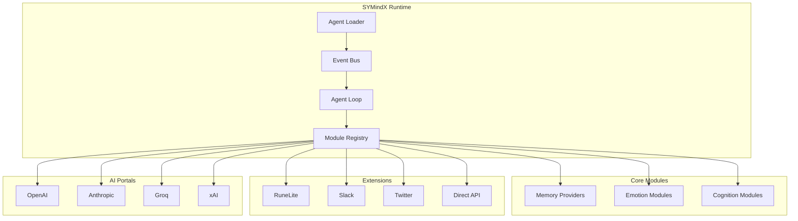

# Introduction to SYMindX

Welcome to **SYMindX** - a cutting-edge, modular AI agent framework designed to create intelligent, emotionally reactive characters that can operate autonomously across games, web platforms, and social media.

## What is SYMindX?

SYMindX is a comprehensive runtime system that enables developers to build AI agents with:

- **🧩 Modular Architecture**: Composable memory, emotion, and cognition systems
- **🎭 Emotional Intelligence**: RuneScape-inspired emotion stack with realistic emotional responses
- **🧠 Advanced Memory**: RAG-powered memory system with vector search capabilities
- **🔄 Autonomous Operation**: Independent thought/emotion/action loops with minimal human intervention
- **🌐 Multi-Platform Integration**: Seamless operation across Discord, Slack, games, and social platforms
- **⚡ High Performance**: Built with TypeScript, Bun, and modern web technologies

## Key Features

### 🤖 Agent System
- **Character-Based Configuration**: JSON-defined agents with unique personalities and behaviors
- **Dynamic Loading**: Hot-swappable agents without system restart
- **Multi-Agent Coordination**: Run multiple agents simultaneously with inter-agent communication
- **Persistent Memory**: Long-term and short-term memory with semantic search

### 🔌 Extension Ecosystem
- **Game Integration**: Direct RuneLite integration for MMO automation
- **Social Platforms**: Native Slack, Discord, Twitter, and Telegram support
- **Web APIs**: RESTful and WebSocket APIs for custom integrations
- **Plugin Architecture**: Easy-to-develop custom extensions

### 🧠 Cognitive Architecture
- **HTN Planning**: Hierarchical Task Network planning for complex goal achievement
- **Reactive Systems**: Immediate response to environmental changes
- **Hybrid Intelligence**: Combined planning and reactive behaviors
- **Context Awareness**: Memory-driven decision making with environmental understanding

### 🎭 Emotion System
- **RuneScape-Inspired Stack**: Emotions like focused, frustrated, excited affect behavior
- **Dynamic Responses**: Emotional states influence tone, decisions, and actions
- **Personality Integration**: Emotions align with character traits and history
- **Visual Feedback**: Real-time emotion visualization in web interface

## Architecture Overview



## Quick Start

Get up and running with SYMindX in under 5 minutes:

```bash
# Clone the repository
git clone https://github.com/symindx/symindx.git
cd symindx

# Install dependencies
bun install

# Configure your environment
cp config/runtime.example.json config/runtime.json
# Edit config/runtime.json with your API keys

# Start the development environment
bun dev
```

Visit `http://localhost:3000` to access the web interface and start building your first AI agent!

## Use Cases

### 🎮 Gaming Automation
- **MMO Bots**: Automated gameplay with intelligent decision-making
- **Strategy Games**: AI opponents with personality and adaptive strategies
- **Social Gaming**: Characters that interact naturally with human players

### 🤝 Virtual Assistants
- **Customer Support**: AI agents that handle support tickets with empathy
- **Personal Assistants**: Scheduling, reminders, and task management
- **Content Creation**: AI writers and social media managers

### 🌐 Social Media Management
- **Twitter Bots**: Engaging content creation and community interaction
- **Discord Moderators**: Intelligent moderation with context awareness
- **Slack Assistants**: Workflow automation and team productivity

### 🏢 Enterprise Applications
- **Process Automation**: Intelligent workflow management
- **Data Analysis**: AI agents that analyze and report on business metrics
- **Integration Platforms**: Connect disparate systems with intelligent routing

## Community and Support

- **📚 Documentation**: Comprehensive guides and API references
- **💬 Discord Community**: Join our active developer community
- **🐛 Issue Tracking**: Report bugs and request features on GitHub
- **📖 Blog**: Stay updated with the latest developments and tutorials

## What's Next?

Ready to dive deeper? Here are your next steps:

1. **[Quick Start Guide](getting-started/quick-start)** - Build your first agent in 10 minutes
2. **[Architecture Overview](architecture/overview)** - Understand the system design
3. **[Agent Development](guides/agent-development)** - Create custom AI characters
4. **[Extension Development](guides/plugin-development)** - Build custom integrations
5. **[Examples](examples/overview)** - Learn from real-world implementations

Welcome to the future of AI agent development with SYMindX! 🚀